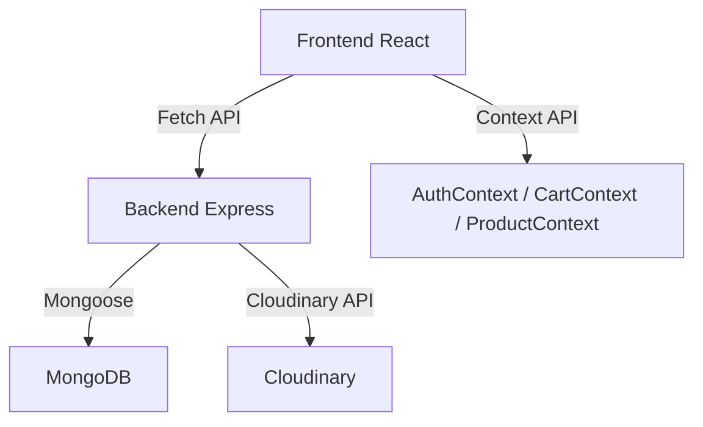
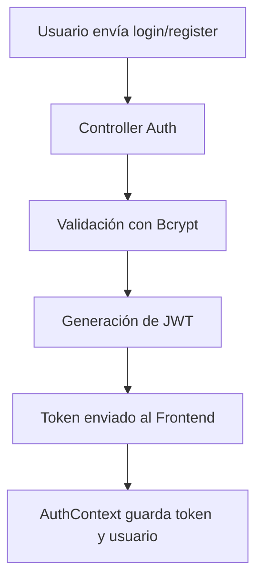
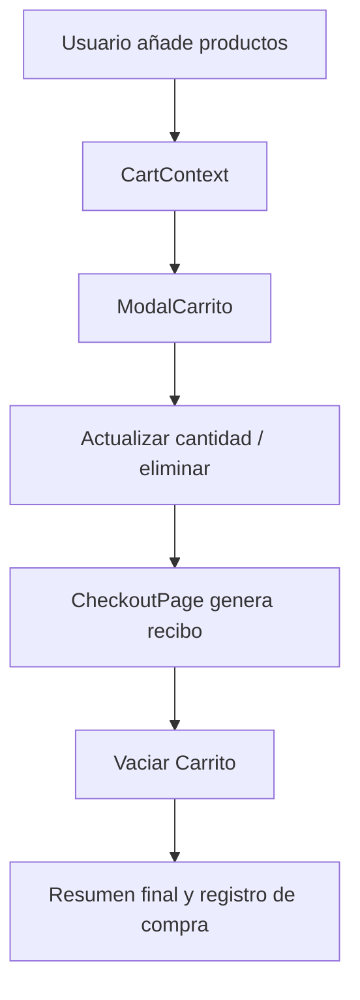
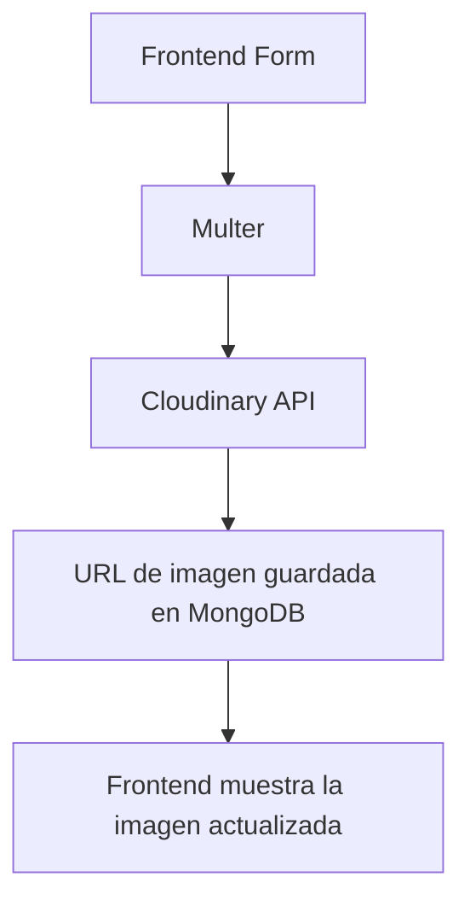

---

# 🪑 **Mueblería Hermanos Jota - README Técnico Avanzado**

[](https://nodejs.org/)
[](https://reactjs.org/)
[](https://www.mongodb.com/)

> Proyecto Full Stack de e-commerce con **CRUD completo de productos**, **carrito persistente**, **checkout**, **panel administrativo**, **Cloudinary**, **JWT**, **Bcrypt** y diseño industrial profesional.

---

## 🌐 **Arquitectura General**



* **Frontend React:** Interfaz dinámica, responsive, modales, checkout y panel admin.
* **Backend Express:** Endpoints REST, validaciones, autenticación y subida de imágenes.
* **MongoDB:** Persistencia de productos, usuarios y mensajes de contacto.
* **Cloudinary:** Almacenamiento de imágenes de productos.

---

## 🧰 **Librerías Instaladas (Backend)**

```bash
npm install express mongoose cors dotenv multer cloudinary bcryptjs jsonwebtoken nodemon
```

* **Express:** Servidor HTTP y rutas.
* **Mongoose:** Modelos y CRUD en MongoDB.
* **Multer + Cloudinary:** Subida y almacenamiento de imágenes.
* **Bcryptjs:** Hash de contraseñas.
* **JSON Web Token (JWT):** Autenticación segura.
* **Dotenv + CORS:** Configuración de entorno y seguridad.

---

## 🔧 **Estructura Backend**

```
backend/
├── controllers/   # Logica: auth, productos, usuarios, contacto
├── middleware/    # Multer, Cloudinary, auth JWT, validaciones
├── models/        # Schemas: Producto, Usuario, Contacto
├── routes/        # Endpoints API
├── public/images/ # Imágenes locales
├── index.js       # Servidor principal
└── .env           # Variables de entorno
```

---

## 🔑 **Flujo de Autenticación**



* El token se envía en cada request protegido.
* Roles: `admin` y `usuario`.
* Middleware verifica rol y token para proteger rutas.

---

## 📦 **Flujo de Carrito y Checkout**



* Carrito se persiste en `localStorage` por usuario.
* Checkout genera un recibo temporal y vacía carrito al finalizar.

---

## 🖥️ **Flujo CRUD Admin (Productos)**

```mermaid
flowchart TD
A[Admin Panel] --> B[Crear / Editar / Eliminar Producto]
B --> C[Controller Productos]
C --> D[Model Producto (MongoDB)]
D --> E[Respuesta JSON al Frontend]
```

* **Crear Producto:** Formulario + subida de imagen a Cloudinary.
* **Editar Producto:** Precarga datos, editar imagen y validaciones.
* **Eliminar Producto:** Confirmación en página separada.
* Tabla de productos con filtros, destacados y stock bajo resaltado.

---

## 🖼️ **Flujo de Subida de Imágenes (Cloudinary)**



* Optimiza almacenamiento y reduce peso en servidor.
* Soporta múltiples formatos y previsualización antes de guardar.

---

## 💻 **Frontend - Context API**

* **AuthContext:** Manejo de sesión, roles y token JWT.
* **CartContext:** Manejo de carrito persistente con métodos: agregar, eliminar, vaciar, actualizar cantidad.
* **ProductContext:** Manejo de productos, destacados y filtros.
* **UIContext:** Gestión de modales y estado visual global.

---

## 🎨 **UI/UX**

* Paleta: Fondo oscuro `#121212`, acento dorado `#FFD700`.
* Tipografía: `Segoe UI` / `Poppins`.
* Cards: Glassmorphism, bordes redondeados, transiciones suaves.
* Responsive para escritorio, tablet y móvil.

---

## 🚀 **Ejecución del Proyecto**

### Backend

```bash
cd backend
npm install
npm run dev
```

### Frontend

```bash
cd client
npm install
npm start
```

---

## 🌍 **Despliegue**

* Generar build optimizado: `npm run build`
* Subir carpeta `build` a servidor o configurar GitHub Pages / Vercel / Render
* Ajustar URL de backend en `.env`

---

## 👨‍💻 **Autores**

| Nombre           | Rol                |
| ---------------- | ------------------ |
| Alexis Coronel   | Frontend & Backend |
| Leandro Ferreira | Frontend & UI/UX   |

---

## 🧾 **Licencia**

MIT License – libre uso, modificación y adaptación.

---
