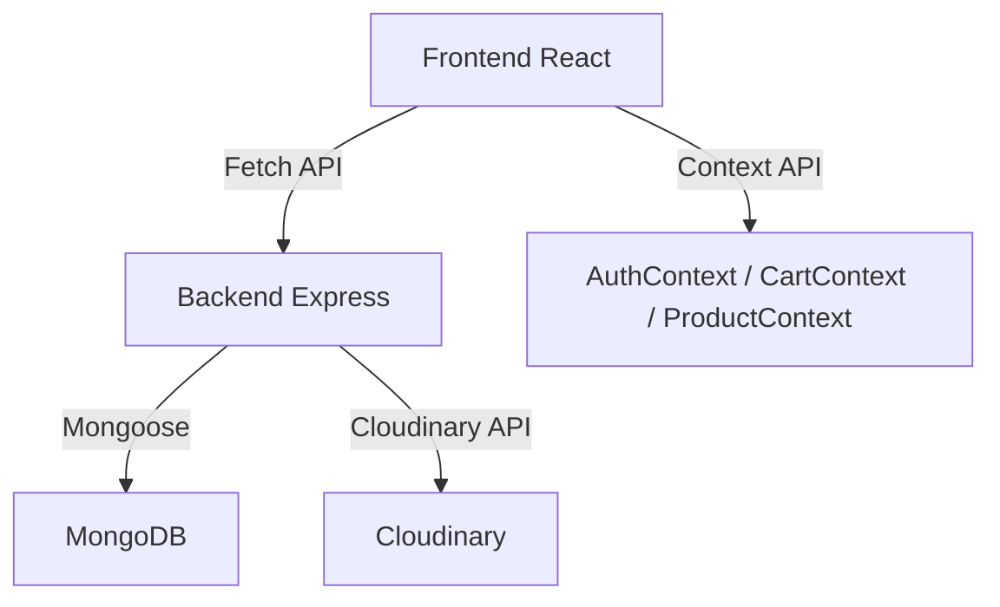
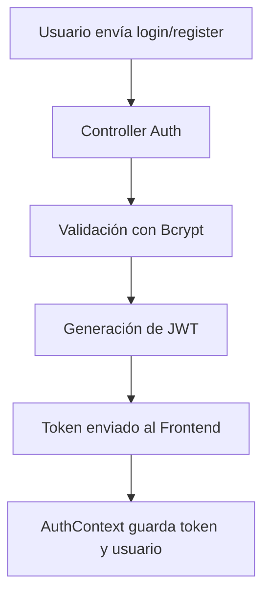
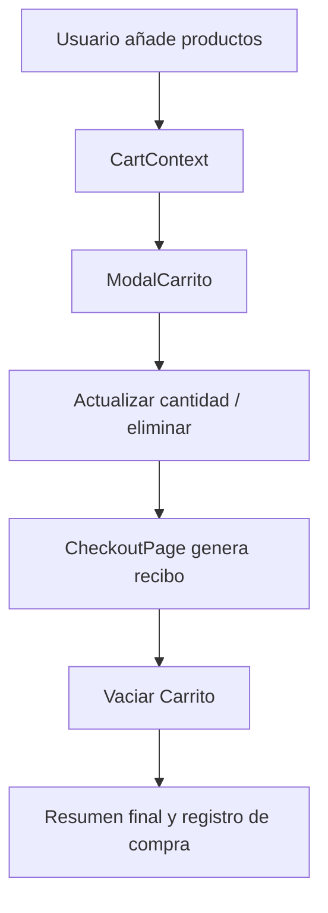
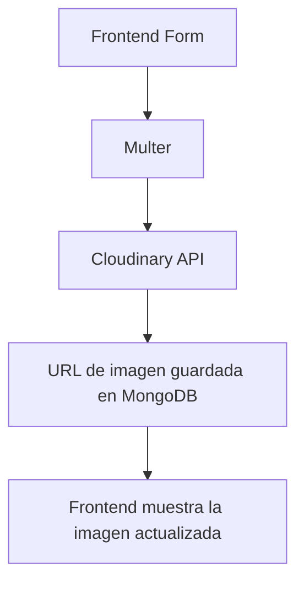
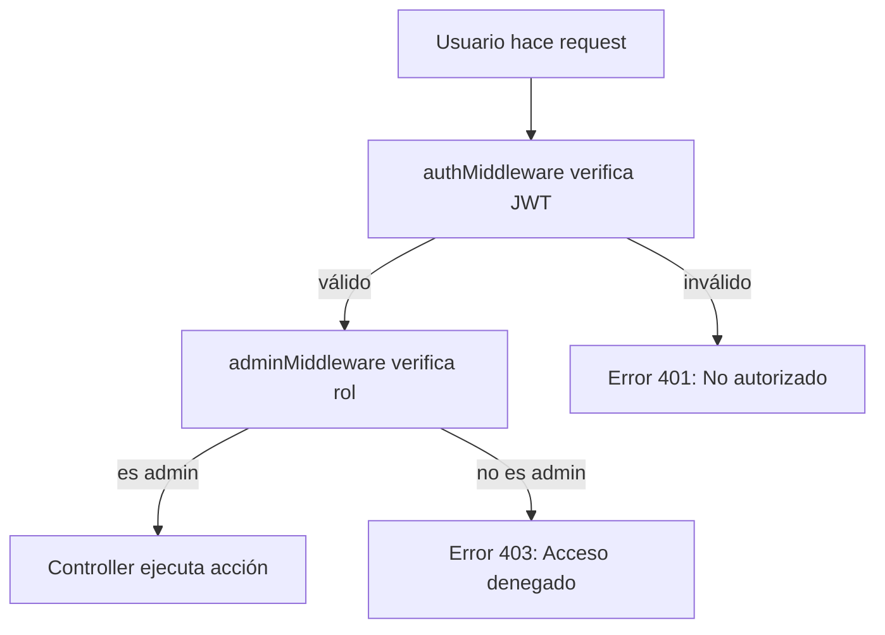
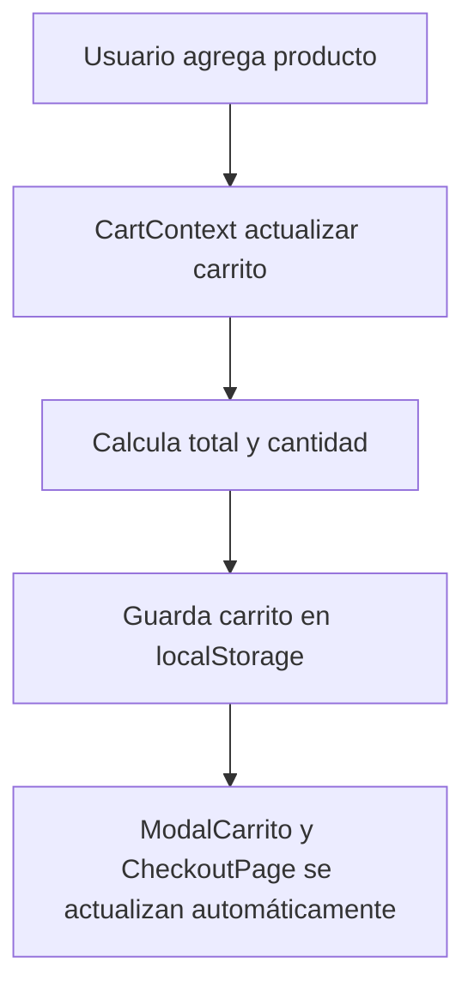
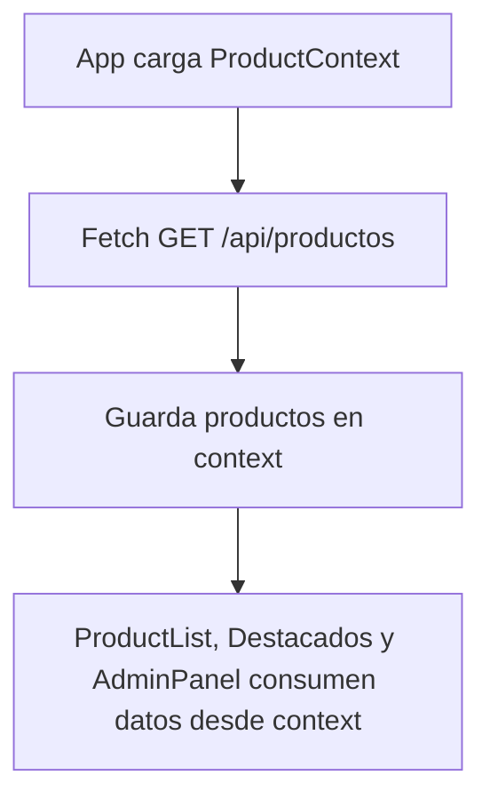

---

# 🪑 **Mueblería Hermanos Jota - README Técnico Avanzado**

[](https://nodejs.org/)
[](https://reactjs.org/)
[](https://www.mongodb.com/)

> Proyecto Full Stack de e-commerce con **CRUD completo de productos**, **carrito persistente**, **checkout**, **panel administrativo**, **Cloudinary**, **JWT**, **Bcrypt** y diseño industrial profesional.

---

## 🌐 **Arquitectura General**



* **Frontend React:** Interfaz dinámica, responsive, modales, checkout y panel admin.
* **Backend Express:** Endpoints REST, validaciones, autenticación y subida de imágenes.
* **MongoDB:** Persistencia de productos, usuarios y mensajes de contacto.
* **Cloudinary:** Almacenamiento de imágenes de productos.

---

## 🧰 **Librerías Instaladas (Backend)**

```bash
npm install express mongoose cors dotenv multer cloudinary bcryptjs jsonwebtoken nodemon
```

* **Express:** Servidor HTTP y rutas.
* **Mongoose:** Modelos y CRUD en MongoDB.
* **Multer + Cloudinary:** Subida y almacenamiento de imágenes.
* **Bcryptjs:** Hash de contraseñas.
* **JSON Web Token (JWT):** Autenticación segura.
* **Dotenv + CORS:** Configuración de entorno y seguridad.

---

## 🔧 **Estructura Backend**

```
backend/
├── controllers/   # Logica: auth, productos, usuarios, contacto
├── middleware/    # Multer, Cloudinary, auth JWT, validaciones
├── models/        # Schemas: Producto, Usuario, Contacto
├── routes/        # Endpoints API
├── public/images/ # Imágenes locales
├── index.js       # Servidor principal
└── .env           # Variables de entorno
```

---

## 🔑 **Flujo de Autenticación**



* El token se envía en cada request protegido.
* Roles: `admin` y `usuario`.
* Middleware verifica rol y token para proteger rutas.

---

## 📦 **Flujo de Carrito y Checkout**



* Carrito se persiste en `localStorage` por usuario.
* Checkout genera un recibo temporal y vacía carrito al finalizar.

---

## 🖥️ **Flujo CRUD Admin (Productos)**

```mermaid
flowchart TD
A[Admin Panel] --> B[Crear / Editar / Eliminar Producto]
B --> C[Controller Productos]
C --> D[Model Producto (MongoDB)]
D --> E[Respuesta JSON al Frontend]
```

* **Crear Producto:** Formulario + subida de imagen a Cloudinary.
* **Editar Producto:** Precarga datos, editar imagen y validaciones.
* **Eliminar Producto:** Confirmación en página separada.
* Tabla de productos con filtros, destacados y stock bajo resaltado.

---

## 🖼️ **Flujo de Subida de Imágenes (Cloudinary)**



* Optimiza almacenamiento y reduce peso en servidor.
* Soporta múltiples formatos y previsualización antes de guardar.

---

## 💻 **Frontend - Context API**

* **AuthContext:** Manejo de sesión, roles y token JWT.
* **CartContext:** Manejo de carrito persistente con métodos: agregar, eliminar, vaciar, actualizar cantidad.
* **ProductContext:** Manejo de productos, destacados y filtros.
* **UIContext:** Gestión de modales y estado visual global.

---

## 🎨 **UI/UX**

* Paleta: Fondo oscuro `#121212`, acento dorado `#FFD700`.
* Tipografía: `Segoe UI` / `Poppins`.
* Cards: Glassmorphism, bordes redondeados, transiciones suaves.
* Responsive para escritorio, tablet y móvil.

---


Perfecto. Vamos a agregar secciones técnicas al README explicando **cómo se crearon las rutas**, cómo funciona el **Navbar** y cómo se implementa el **control de acceso para usuarios/admin**. Te lo detallo en formato que puedes añadir directamente al README técnico.

---

## 🛣️ **Creación de Rutas API (Backend)**

El backend está organizado con **rutas separadas por módulo**:

```
backend/routes/
├── authRoutes.js         # Login y registro
├── productoRoutes.js     # CRUD de productos
├── contactoRoutes.js     # Formulario de contacto
└── usuarioRoutes.js      # Gestión de usuarios (opcional)
```

### Ejemplo de `productoRoutes.js`:

```js
import express from "express";
import { getProductos, createProducto, updateProducto, deleteProducto } from "../controllers/productController.js";
import { authMiddleware, adminMiddleware } from "../middleware/auth.js";
import { upload } from "../middleware/upload.js";

const router = express.Router();

// Listar productos (público)
router.get("/", getProductos);

// Crear producto (solo admin)
router.post("/", authMiddleware, adminMiddleware, upload.single("imagen"), createProducto);

// Editar producto (solo admin)
router.put("/:id", authMiddleware, adminMiddleware, upload.single("imagen"), updateProducto);

// Eliminar producto (solo admin)
router.delete("/:id", authMiddleware, adminMiddleware, deleteProducto);

export default router;
```

**Notas técnicas:**

* Se usan **middlewares** para validar que el usuario esté autenticado (`authMiddleware`) y sea admin (`adminMiddleware`).
* Las imágenes se procesan con **Multer** y se suben a **Cloudinary**.
* Todas las respuestas son en **JSON**, para que el frontend pueda manejar errores y datos de manera uniforme.

---

## 🖥️ **Navbar y Control de Sesión**

El `Navbar` es un componente global que depende de `AuthContext` y `CartContext`:

* Muestra enlaces según si el usuario está logueado o no.
* Muestra el contador del carrito en tiempo real.
* Oculta enlaces de **admin** a usuarios normales.
* Permite cerrar sesión, eliminando el token del `localStorage`.

```js
{user && user.rol === "admin" && (
  <NavLink to="/admin">Panel Admin</NavLink>
)}
```

**Características:**

* React `useContext` para acceder a `user` y `carrito`.
* Actualización en tiempo real del número de productos en carrito.
* Redirección automática si un usuario no autorizado intenta acceder a rutas protegidas.

---

## 🔒 **Protección de Rutas (Middleware de Admin)**

Middleware `auth.js` usado en backend:

```js
import jwt from "jsonwebtoken";
import User from "../models/User.js";

// Valida token JWT
export const authMiddleware = async (req, res, next) => {
  const token = req.header("Authorization")?.replace("Bearer ", "");
  if (!token) return res.status(401).json({ mensaje: "Token no provisto" });

  try {
    const decoded = jwt.verify(token, process.env.JWT_SECRET);
    req.user = await User.findById(decoded.id);
    next();
  } catch {
    res.status(401).json({ mensaje: "Token inválido" });
  }
};

// Valida que el usuario sea admin
export const adminMiddleware = (req, res, next) => {
  if (req.user?.rol !== "admin") {
    return res.status(403).json({ mensaje: "Acceso denegado: solo administradores" });
  }
  next();
};
```

**Flujo de autorización:**



* Así se asegura que **usuarios normales no puedan crear, editar ni eliminar productos**, ni acceder al panel administrativo.
* Solo **admins autenticados** tienen acceso completo a rutas protegidas.

---

## 🔄 **Contextos y Flujo de Datos (Frontend React)**

Para mantener la aplicación modular y mantener **estado compartido**, se crearon varios **Contexts** en React:

### 1️⃣ **AuthContext**

* Gestiona la sesión del usuario: login, logout y almacenamiento de token JWT en `localStorage`.
* Proporciona información del usuario (`user`) y su rol (`admin` o `cliente`).
* Permite mostrar/ocultar enlaces en `Navbar` según permisos.

**Flujo de autenticación:**

```mermaid
flowchart TD
A[Formulario de Login] --> B[AuthContext login()]
B --> C[Fetch POST /api/auth/login con credenciales]
C -->|200 OK + token| D[Guarda JWT en localStorage y user en context]
D --> E[Navbar y rutas protegidas actualizan estado]
```

---

### 2️⃣ **CartContext**

* Administra el **carrito de compras**.
* Permite agregar, eliminar, actualizar cantidades y vaciar el carrito.
* Persiste los datos en `localStorage` por usuario (`carrito_{user._id}`).
* Calcula automáticamente `total` y `cantidadTotal`.

**Flujo de carrito:**



---

### 3️⃣ **ProductContext**

* Gestiona la lista de productos obtenida desde la API (`/api/productos`).
* Permite filtrar, buscar y mostrar productos destacados.
* Facilita la sincronización con panel admin (crear, editar, eliminar).

**Flujo de productos:**



---

### 4️⃣ **UIContext**

* Controla modales, toasts y estados visuales globales (por ejemplo `ModalCarrito` abierto/cerrado).

---

### 🔗 **Flujo General de Datos Frontend <-> Backend**

```mermaid
flowchart TD
subgraph FRONTEND
    Login[Login Form] --> Auth[AuthContext]
    Cart[Carrito] --> CartContext
    Products[ProductList / Destacados] --> ProductContext
    Navbar --> Auth
    CheckoutPage --> CartContext
end

subgraph BACKEND
    API[Express API] --> DB[(MongoDB)]
    AuthAPI[/api/auth/] --> API
    ProductAPI[/api/productos/] --> API
    CartAPI[Carrito (persistencia local)] --> API
end

AuthContext -->|POST /api/auth/login| AuthAPI
AuthContext -->|GET /api/usuarios/:id| AuthAPI
ProductContext -->|GET /api/productos| ProductAPI
ProductContext -->|POST/PUT/DELETE| ProductAPI
CartContext -->|localStorage / sync con user| CartAPI
```

---

**Beneficios de esta arquitectura:**

* Estado centralizado y compartido entre componentes.
* Sincronización automática de datos UI con backend.
* Control de acceso granular (admins vs usuarios normales).
* Facilita la extensión futura (por ejemplo, agregar notificaciones, historial de compras, etc.).

---

## 🚀 **Ejecución del Proyecto**

### Backend

```bash
cd backend
npm install
npm run dev
```

### Frontend

```bash
cd client
npm install
npm start
```

---

## 🌍 **Despliegue**

* Generar build optimizado: `npm run build`
* Subir carpeta `build` a servidor o configurar GitHub Pages / Vercel / Render
* Ajustar URL de backend en `.env`

---

## 👨‍💻 **Autores**

| Nombre           | Rol                |
| ---------------- | ------------------ |
| Alexis Coronel   | Frontend & Backend |
| Leandro Ferreira | Frontend & UI/UX   |

---

## 🧾 **Licencia**

MIT License – libre uso, modificación y adaptación.

---
